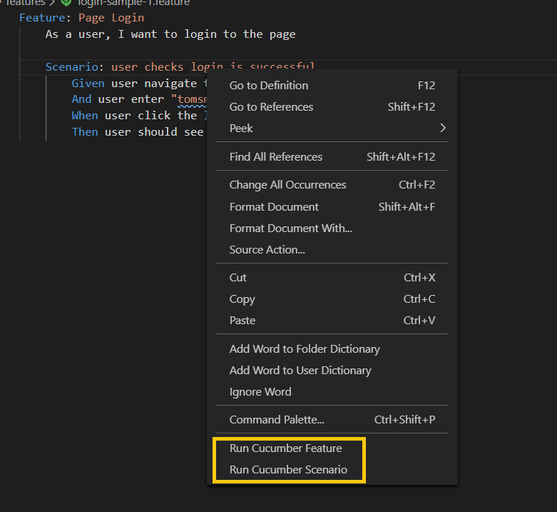

# Protractor Cucumber Serenity TypeScript Starter

[](http://commitizen.github.io/cz-cli/)

## Key highlights of the starter pack

This starter pack is a killer combination of different javascript modules to enable you develop a cleaner and faster automation suite for testing angular/non-angular apps and meet business requirements in a more reliable and scalable way!

- _**Auto retry mechanism**_ for frequently used Protractor methods, like click, sending values to input etc. Now, Protractor will auto retry most of the methods in a given amount of time. This will reduce the flakiness in your code thus make your team have faith in your automation suite.
- All scripts written with > Typescript3.x & Cucumber6.x
- Neat folder structures.
- _**No**_ JavaScript transpilation needed. You can create, modify and run TS files directly.
- Page Object design pattern implementation.
- Screenshots on failure feature scenarios.
- Famous Serenity-Js and Jenkins reporting implemented.
- ES Lint support to force you write better codes.
- Automated Accessibility Testing and Reporting added.
- _**React Selector**_ support. You can identify a React Element by component, props and state. usage info [here](https://www.npmjs.com/package/protractor-react-selector)

## Table of Contents

- [Get Started](#get-started)
  - [Pre-requisites](#pre-requisites)
  - [Recommended IDE](#recommended-ide)
  - [Install VSCode Extensions](#install-vscode-extensions)
- [Setup Scripts](#setup-scripts)
  - [Install the dependencies:](#install-the-dependencies-)
  - [One Time Setup](#one-time-setup)
  - [Setup Test Environment](#setup-test-environment)
  - [Run Tests](#run-tests)
  - [Generate Reports](#generate-reports)
- [Multi-Browser Testing](#multi-browser-testing)
- [Lint Automation Code](#lint-automation-code)
- [Debug Code](#debug-code)
- [Quick guide to writing tests](#quick-guide-to-writing-tests)
  - [Writing Features](#writing-features)
  - [Writing Page Objects](#writing-page-objects)
  - [Writing Step Functions](#writing-step-functions)
  - [Writing Step Definitions](#writing-step-definitions)
  - [Test Reports](#test-reports)
- [Serenity Dashboard](#serenity-dashboard)
- [Framework ADD-ons](#framework-add-ons)
  - [Auto Retry Mechanism](#auto-retry-mechanism)
  - [Automated Accessibility Testing](#automated-accessibility-testing)
  - [Automated Database Testing [Microsoft SQL Server]](#automated-database-testing--microsoft-sql-server)
- [Contributions](#contributions)

## Get Started

#### Pre-requisites

1. NodeJS installed globally in the system.Download the MSI [for windows] here- https://nodejs.org

2. Install JRE (1.8.x)

> JAVA_HOME should be properly set. Do not include the /bin directory when setting JAVA_HOME

3. Browser version :

> Chrome >= 74

> Firefox >= 69

> IE >= 11

#### Recommended IDE

VSCode

#### Install VSCode Extensions

Please Install all the VS code plugins recommended in Project settings (.vscode > extensions.json). Once you open the starter project in your VS Code for the first time, wizard will show you the recommended extensions. Click "Install All" and once the installation is successful, restart VS Code IDE.

<details>
  <summary>Show Wizard</summary>
  
  
</details>

## Setup Scripts

- Clone the repository into a folder
- Go inside the folder and make sure _**.npmrc**_ values are set correctly. sometimes organizations use their own registry. In that case, provide the registry details correctly.

```ts
unsafe-perm=true
strict-ssl=false
registry=https://registry.npmjs.org/
```

#### Install the dependencies:

```
// run the command inside the root
npm install
```

#### One Time Setup

> The below script will download the driver binaries.

```
npm run setup
```

<details>
  <summary>Setup with proxy</summary>
  if you are in a restricted environment (vm, docker etc.), then you may need proxy to update the web-driver manager. You need to modify the command like below:

```
npm run setup -- --proxy="http://your-comapny-proxy.com:port-number"
```

> Note That: If you face any issue with certificates related to your secure environment, try to run npm install with ignore ssl. In special scenario, you need to add certificates (if any) for the npm install command to run seamlessly.

</details>

#### Setup Test Environment

> Test environment can be configured in the **.env** file in project root directory

```js
# App Configuration
APP_BASE_URL=https://the-internet.herokuapp.com

# Test Configuration
WAIT_FOR_ANGULAR=false // set true, if testing angular apps
RUN_TEST_PARALLEL=false // set true, if you want to run features in parallel
MAX_BROWSER_INSTANCE=1 // if parallel is set to true, specify how many browser instances you need
GLOBAL_TIMEOUT=11000 // global timeout in milliseconds
IMPLICIT_WAIT=6000 // implicit timeout in milliseconds
TEST_REPORT_DIRECTORY=target // specify the folder name where you want to generate all reports
```

</details>

#### Run Tests

Different run configurations can be set in package.json file.

```ts
// to run all tests. By-default tests will be executed in chrome.
npm run e2e

// to run specific tag
npm run e2e -- --cucumberOpts.tags="@your-tag"

// if you want to run all - lint -> test -> report
npm run e2e test
```

Running single scenario/feature from CLI sometimes become hectic. We incorporated _**Cucumber Quick**_ plugin to make that task easy. Right click on any feature file and choose to run a single scenario/feature.



#### Generate Reports

To generate Serenity Report, you need to run below command:

```ts
// to generate serenity report
npm run report

// to generate jenkins friendly xml report
npm run report:jenkins
```

Reports will be available in target > site > serenity > index.html

## Multi-Browser Testing

You can execute tests in your favorite browser just passing some extra flags from CLI.
By default , all tests executes on **_Chrome_** browser

```ts
// by default it executes on Chrome
npm run e2e

// Run tests on Firefox
npm run e2e -- --browser=firefox

//Run tests on Internet Explorer
npm run e2e -- --browser="internet explorer"

// to run in chrome headless
npm run e2e -- --headless

// to run in firefox headless
npm run e2e -- --browser=firefox --headless

```

## Lint Automation Code

```
//lint your code
npm run lint

// fix the linting issues automatically
npm run lint:fix
```

## Debug Code

Debugging is pretty easy with this framework. Debug configurations are configured in .vscode > launch.json file. To debug your code, you need to follow below steps in VS Code:

> Mark your break points

> Annotate the target scenario with **@debug** annotation

> Press f5 or go to Debug > start debugging

As soon as you press the debug button, pre-debugging tasks (clean + build) will start. After the pre-launch task is completed, navigate to debug console to view the run time debug status.

## Quick guide to writing tests

#### Writing Features

- Create feature file to describe the test scenarios
- Path: e2e/features

```feature
Feature: Page Login
	As a user, I want to login to the page

	Scenario: user checks login is successful
		Given user navigate to the target login page
		And user enter "tomsmith" and "SuperSecretPassword!"
		When user click the login button
		Then user should see the login success message

```

#### Writing Page Objects

- Create a page object class to store the page elements.
- Path: e2e/model/pageObjects
- Export the pageObject in _**index.ts**_

```ts
this.urlRoute = '/login';
this.usernameField = element(by.css('[id="username"]'));
this.passwordField = element(by.css('[id="password"]'));
this.loginBtn = element(by.css('button'));
this.loginSuccessMsg = element(by.xpath('//div[contains(@class,"success")]'));
```

#### Writing Step Functions

- Create a step function class to define all the page interactive functions. Here, make use of the elements declared in previous step.
- Path: e2e/model/stepFunctions
- Export the page functions in _**index.ts**_

```ts
  async launchLoginUrl() {
    await browser.get(browser.baseUrl + loginPage.urlRoute);
  }

  async setUserName(userName: string) {
    await p.typeValue(loginPage.usernameField, userName);
  }

  async setUserPassword(password: string) {
    await p.typeValue(loginPage.passwordField, password);
  }

  async clickLoginBtn() {
    await p.click(loginPage.loginBtn);
  }

  async checkLoginSuccess() {
    await expect(loginPage.loginSuccessMsg).to.be.present;
  }
```

#### Writing Step Definitions

- Create a step definition class to glue the feature steps with step functions.
- Path: e2e/model/stepDefinitions

```ts
Given(/^user navigate to the target login page$/, async () => {
  await loginFunctions.launchLoginUrl();
});

When(
  /^user enter "(.*)" and "(.*)"$/,
  async (username: string, password: string) => {
    await loginFunctions.setUserName(username);
    await loginFunctions.setUserPassword(password);
  }
);
```

#### Test Reports

If **target** folder is configured as your base reporting directory in **.env** file, then execution reports would be available in **target** folder.

> Accessibility reports --> target/accessibility

> Serenity reports --> target/site/serenity/index.html

## Serenity Dashboard

Currently this project has been integrated with Serenity-JS. Reports produced are user-friendly and BDD structured.


Each Test contains Screenplay pattern insight reports


## Framework ADD-ons 

#### Auto Retry Mechanism

A core feature of the starter pack that assists with testing dynamic web applications is retry-ability.

- What if the application has not updated the DOM by the time these commands run?
- What if the application is waiting for its back end to respond before populating the DOM element?
- What if the application does some intensive computation before showing the results in the DOM?

Here comes framework core object _**p**_. This object has some smarter error handling mechanism to auto retry it's methods if any webdriver error occurs. It keeps on running the same command until it gets successful within the limit of implicit wait. So, you don;t have to rely on the _**wait**_ mechanism anymore to check an element is clickable or visible. The p object handle the same with auto-retry mechanism.

current the p object from the core supports frequently used protractor command. Feel free to raise an ticket if some commands are missing from p's list.

```ts
import { p } from 'core';

async clickButton(){
  const myElement=element(by.css('button'));
  await p.click(myElement);
}

// other p methods
await p.typeValue(myInputElement,'hello');
await p.selectValueFromList(muULListElement, 'option1');

// and... many more. Just start typing p dot and the whole list of supported methods will appear
```

_**Import Note:**_ do not use protractor native command, alway use p commands to have more stability in the test case.

#### Automated Accessibility Testing

A webpage/element should abide by market standard accessibility rules like 'wcagA' , 'wcagAA' , 'section 508' etc. Identifying all the violated rules manually can be very time consuming process. To reduce the manual effort, we introduce a feature in this starter framework to perform the accessibility checks automatically. Axe is a market leader to help running the accessibility tests automatically. We integrated Axe-protractor plugin with BDD approach.

You can configure the required rules in browser configurations:

```ts
plugins: [
  {
    displayHelpUrl: false, // Displays the aXe help URL along with the error. Defaults to true.
    displayContext: true, // Displays the HTML of interest. Defaults to true.
    displayPasses: true, // Display pass results. Defaults to true.
    displayViolations: true, // Display violations. Defaults to true.
    standardsToReport: ['wcaga', 'wcagaa'], // A list of standards to report on. If empty, reports on all standards.
    ignoreAxeFailures: false, // If true, aXe failures won't cause the whole test to fail. Defaults to false
    htmlReportPath: 'target/accessibility',
    package: 'protractor-axe-html-report-plugin',
  },
];
```

You can use the plugin in two different ways:

```feature
Given user is in login page
Then user check the accessibility for element ".masterClass>div"

# OR
Then user run accessability test on the current page
```

Accessibility test reports will be stored in target/accessibility folder.

#### Automated Database Testing [Microsoft SQL Server]

Framework supports to test MS SQL tests. You can leverage the framework like below:

- Add your database credentials in **_.env_** file

```ts
# If you need SQL database testing, fill in below parameters
APP_DB_SERVER=localhost
APP_DB_USERNAME=sa
APP_DB_PASSWORD=nPQnFA3DxK60iS/8J4BLBA==  //provide encrypted password
APP_DATABASE=Your_DB_Name
```

- To get your encrypted pass word

```ts
npm run encrypt-password your-password
```

- Develop your functions using the **_databaseHelper_** from framework **_core_**

```ts
import { logger, databaseHelper } from 'core/utils';

export const getUserIDFromDB = async (userName: string) => {
  const selectQuery: string = `select userID from users where userName = '${userName}' and userLanguage='ENG'`;
  const results: IResult<any> = await databaseHelper.queryDB(selectQuery);
  const userID: string = results.recordsets[0][0].userID;
  logger.info(`user id for username ${userName} is ${userID}`);
  return appID;
};

//now you just need to call the method from your step definition file
```

## Contributions

For contributors who want to improve this repo by contributing some code, reporting bugs, issues or improving documentation - PR's are highly welcome, please maintain the coding style , folder structure , detailed description of documentation and bugs/issues with examples if possible.

Please follow the [Coding Guidelines](artifacts/guidelines).

See the [contributing](artifacts/CONTRIBUTING.md) documentation for information on contributing the this project.
